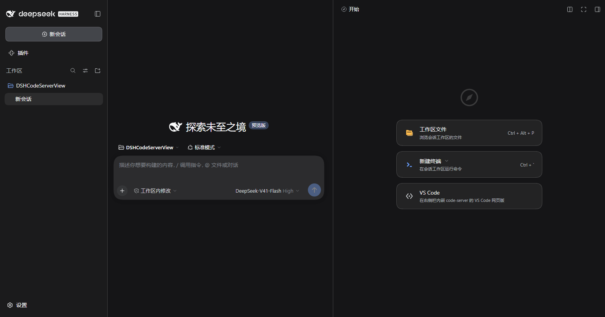
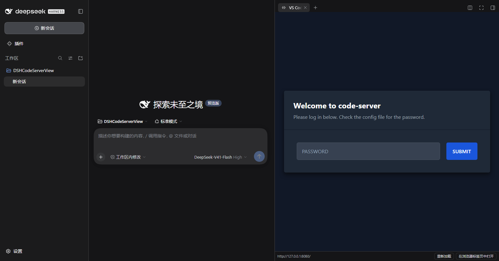
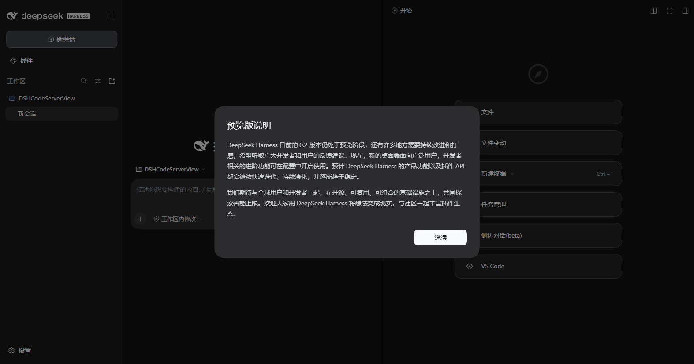
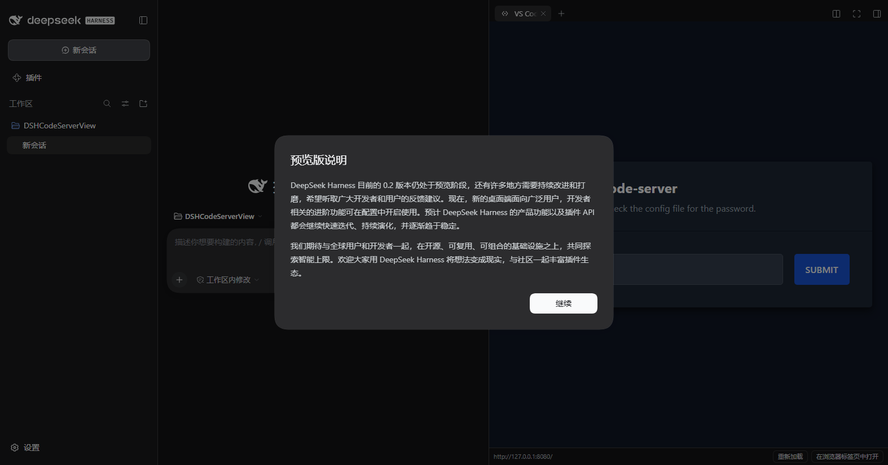
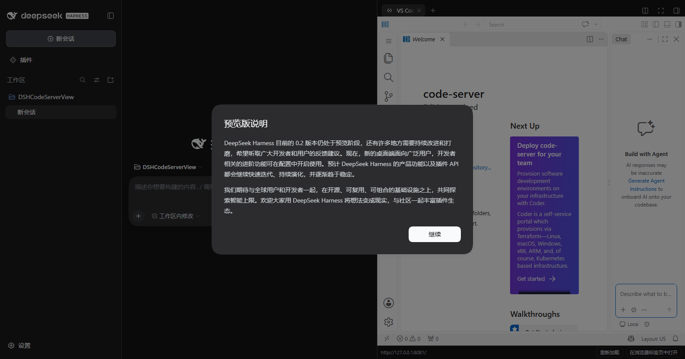
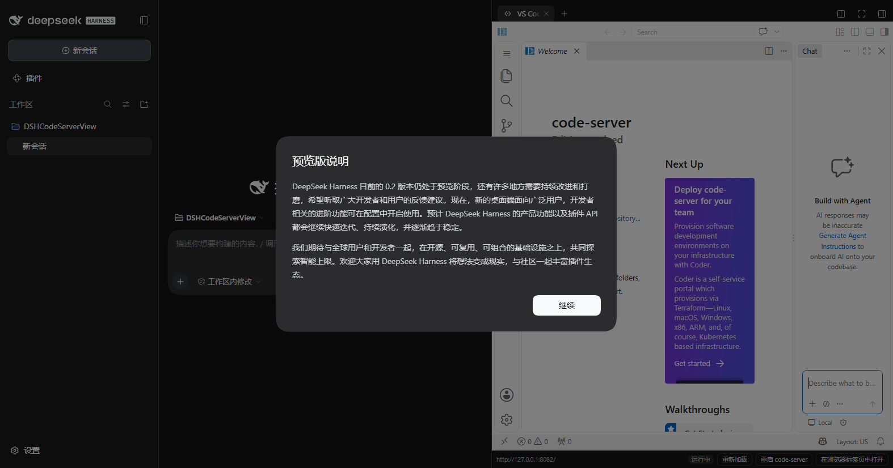
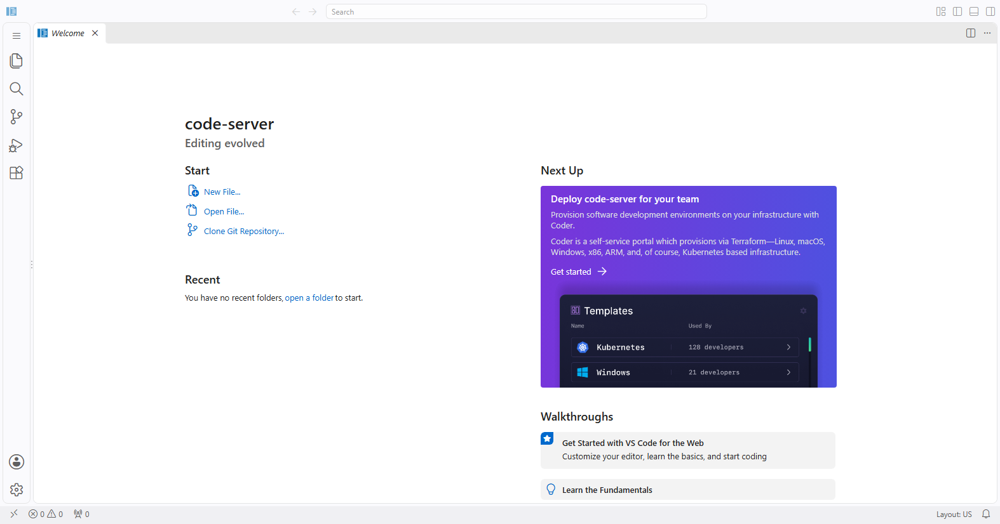

# 验证记录

本文是 [README](../README.md) 的验证附录：每一项都在这台机器上实测过，截图内嵌在对应小节里（文件在图床目录 [`verification/`](verification/)）。

- 验证环境：Windows + DSH `0.2.0-rc.2`（安装版）+ code-server `4.140.0`。下文把本机路径写成占位：`<repo>` = 本仓库、`<code-server>` = code-server 安装根目录、`<temp>` = 临时目录
- 全部在**隔离的临时 `DSH_HOME`** 里进行，未改动任何现有 profile
- 契约测试：`npm test` → **45 项契约 + 12 项文档检查**（零依赖）

---

## 一、契约与装载

- 宿主半部在真实组合中装载：日志 `[code-server-view] host half mounted`
- 服务端渲染的首页启动图里出现 `{"id":"DSHCodeServerView","url":"plugins/??DSHCodeServerView/client.js&rev=…","inject":[…]}`，并被编进 bootstrap 批次
- `/plugins/??DSHCodeServerView/client.js&rev=…` 返回 200，且响应体与本仓库 `client.js` **逐字节一致**（仅追加一个 `;` 与 sourcemap 尾注）
- 用 DSH 同款 React 18.3.1 渲染正文组件，产出 `<iframe src="http://127.0.0.1:8080/" allow="clipboard-read; clipboard-write; fullscreen">`

## 二、真实浏览器里的界面验证

无头 Edge 154 + DevTools 协议驱动真实 DSH Web 客户端，按用户路径逐步走通：

| 步骤 | 证据 |
|---|---|
| 客户端启动 | 页面内 `window.__DSH_BOOT__` 含本插件条目，`#root` 完成挂载 |
| 引导页出现卡片 | 右侧栏引导页里与 DSH 自带的「工作区文件」「新建终端」并列出现 **VS Code** 卡片，标题与描述来自本插件 locale |
| 点击卡片打开面板 | 右侧栏出现原生标签页，chip 文本 `VS Code`（本插件注册的标题座位 + 自绘图标） |
| 正文渲染 | `iframe[src="http://127.0.0.1:8080/"]`，实测尺寸 **707×757 px**，面板内渲染出 code-server 的登录页 |
| 本地控件 | 工具条显示地址、`重新加载`、`在浏览器标签页中打开`，按钮存在于可点击元素列表中 |





## 三、与 `dsh-better-sidebar` 共存

`dsh-better-sidebar` 接管了 DSH 原生右侧栏（`desktop` profile 里实际装着的那个），所以另起一个 profile 验证：`dsh-base` + `dsh-web-app` + `dsh-better-sidebar` + `DSHCodeServerView`。

- 启动图里两个插件条目同时存在，两个 client bundle 都返回 200（better-sidebar 的 1.08 MB）
- 引导页里 better-sidebar 自己的页签（`文件`、`文件变动`、`任务管理`、`侧边对话(beta)`）与本插件的 **VS Code** 卡片并列出现，互不遮挡
- 点开 VS Code 卡片后结果与裸 profile 完全一致：`iframe[src="http://127.0.0.1:8080/"]`、**707×757 px**、渲染出 code-server 登录页





## 四、真实安装路径与运行时表现

在**正在运行**的隔离实例上执行真实安装命令（与 Desktop 插件页内部走同一套 `operations.ts`）：

```sh
dsh plugin --profile devtest add <repo>
# dependencies: + DSHCodeServerView link:<repo>
```

| 观察项 | 结果 |
|---|---|
| 清单改动 | pnpm 建立目录链接，并**自动**把 `DSHCodeServerView` 追加进 `dsh.profile.bundles`（无需手改） |
| 是否需要重启 | **不需要**。4 秒内运行中的实例启动图就出现本插件条目，宿主日志打印 `[code-server-view] host half mounted` |
| Plugins 页 | `已安装 1`：标题 `VS Code（code-server）`、描述来自 `locale/zh.json`，状态 `running`，开关为启用 |
| 图标 | 页面渲染 ``，解码后正是本仓库的 `icon.svg`（24×24） |

图标这一项踩过一个坑，值得留给后来者：Plugins 页的图标来自**清单根字段 `icon`**，或退而求其次读导出的 `<包名>/icon`。实测后者在本机 loader 的解析下会**静默失败**（普通 `require.resolve('DSHCodeServerView/icon')` 能解析，但 `readPluginMeta` 走的是另一套 resolver），表现是页面渲染兜底字形而非你的图标。所以 `package.json` 里必须显式写 `"icon": "./icon.svg"`（`exports["./icon"]` 保留即可）。

## 五、配置项与自动登录

另起一个**带已知密码**的 code-server（`127.0.0.1:8081`，`auth: password`，独立数据目录），把隔离实例的插件配置指向它：

| 观察项 | 结果 |
|---|---|
| 宿主装载 | 日志 `… code-server http://127.0.0.1:8081/ (auto-login configured)` |
| 配置路由 | `GET /codeserver-view/config` → `{"url":"http://127.0.0.1:8081/","autoLogin":true,"hasPassword":true,…}` —— 响应体里**没有**密码字段 |
| 登录路由 | `GET /codeserver-view/login` → `action="http://127.0.0.1:8081/login?to=%2F"` 的自动提交表单，密码经属性转义 |
| 浏览器行为 | 点开 VS Code 卡片后 iframe 指向 `/codeserver-view/login`，随后 `document.cookie` 出现 `code-server-session`（`autoLoggedIn: true`），面板渲染出**已登录的 VS Code 工作台** |
| 工具条 | 显示配置的地址 `http://127.0.0.1:8081/`（而不是登录路由） |
| 反例 | 用错密码时 code-server 的 `/login` 返回 200 登录页（curl 单独确认），面板于是显示登录表单而不是白屏 |
| 配置热更新 | 把补丁里的 `url` 从 8081 改成 8080 并保存，**4 秒后**运行中实例的 `/codeserver-view/config` 就返回新地址（HMR 热替换宿主半部，无需重启）；改**插件源码**则必须重启（已实测区分） |



## 六、进程托管

隔离实例：`manage: true` + `root: <code-server>` + 独立 `dataDir`，端口 8082。

| 观察项 | 结果 |
|---|---|
| 自动拉起 | 日志 `starting code-server from <code-server> (config)` → `code-server is running at http://127.0.0.1:8082/`；`/healthz` 返回 200 |
| 真实进程 | `<code-server>\lib\node.exe <code-server> --bind-addr 127.0.0.1:8082 --user-data-dir …`，**父进程就是 DSH 宿主**（在 Job Object 内），命令行里**没有密码** |
| 状态发布 | `/codeserver-view/config` → `supervisor: {mode:"managed", state:"running", root:"<code-server>", rootSource:"config", version:"4.140.0", …}` |
| 面板 | 工具条显示地址、**`运行中`** 徽标、`重新加载`、**`重启 code-server`**、`在浏览器标签页中打开`；iframe 经宿主登录页自动登录后直接进入工作台 |
| 接管而非重复 | 地址已有人应答时 `mode: attach`、`state: attached`，**不产生任何 spawn** |
| 重启 | `POST /codeserver-view/restart` → 旧进程 9128 消失、新进程 27324 起来、端口重新 200，返回的 status `uptimeMs: 0` |
| 不留孤儿 | 只 `Stop-Process` 掉 DSH 宿主进程（**不做树杀**），2 秒内 code-server 随之消失、端口释放 —— Job Object 的 kill-on-close 生效，无需 `stopOnUnload` |



## 七、Copilot 禁用层

隔离实例：`manage: true` + `copilot.disable: true` + 独立 `dataDir`/`workDir`。

| 观察项 | 结果 |
|---|---|
| 宿主日志 | `built-in extensions filtered: 95 kept, 1 removed (GitHub.copilot-chat)` |
| spawn argv | `… --user-data-dir <data> --builtin-extensions-dir …\work\builtin-extensions\afc76cb5ee3571af` |
| 过滤目录 | 95 个 junction，**没有 `copilot` 条目**；`manifest.json` 记录 `excluded: ["GitHub.copilot-chat"]` |
| 设置 | `<data>\User\settings.json` 合并为 AI-off 五键（原文件先备份成 `settings.json.dsh-backup`） |
| 残留清理 | 预置的三处残留（`User/globalStorage/github.copilot-chat`、`extensions.builtin.cache`、`customBuiltinExtensionsCache.json`）被逐个报告并删除；无关状态原样保留 |
| 幂等 | 第二次启动指纹未变 → **不重建**（日志无 rebuild 行），`builtin-extensions` 下只有一个指纹目录 |
| 安全护栏 | 把 `workDir` 指到安装目录或插件包内 → 状态 `unsafe-work-dir`，**什么都没创建** |
| **VS Code 自己的解析结果** | 客户端连上后 VS Code 重新生成的 `extensions.builtin.cache`：**94 个内置扩展，id 含 "copilot" 的数量为 0**，且所有 location 都指向过滤目录 |
| 界面 | 工作台活动栏**没有 Chat/Copilot 图标**、右侧**没有 Chat 面板**、欢迎页**没有 "Build with Agent" 卡片** |



## 八、升级后不变的东西

- `<code-server>\lib\vscode\product.json` 的 mtime 仍是安装时的日期 —— **发行版一个字节都没被改**
- 子模块 `vendor/code-server` 工作区干净，`git -C vendor/code-server status` 无输出；HEAD 与父仓库记录的 gitlink 都是 `ccc19ad`（`v4.140.0`）
- 插件不写任何位置的 git 状态：`workDir` 默认在仓库外（`$DSH_HOME\cache\code-server-view`），若被指进插件包或安装目录则拒绝执行

---

## 仍未验证

- 用**你自己的** code-server 密码登录后的观感（本附录的自动登录/工作台验证用的是自建测试实例）
- 装进真实 `desktop` profile 之后的运行——插件尚未安装（步骤见 README「安装」方式 A）
- 改造 `lib\vscode\product.json`（"连 Chat 身份一起去掉"）——该激进项**未实现**
